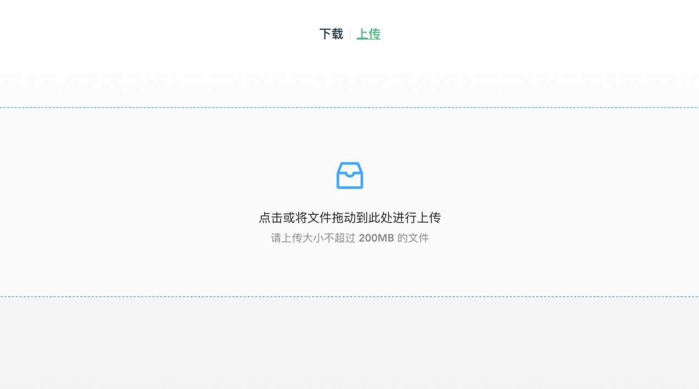

# @chosan/server

一键启动的文件服务器，提供文件上传和下载功能。UI 兼容 IE9+，服务端 Node 版本 >= `8.3.0`

## 使用场景

- 内外网文件共享
  - 接收文件上传
  - 提供文件下载

## 安装

`npm i -g @chosan/server` 或者 `yarn global add @chosan/server`

## 用法

可以使用 `server` 命令快速启动一个 http 服务器，可携带命令行参数

## 参数介绍

- `p`：指定端口号（默认 `8888`）
- `u`：启用上传功能（默认关闭）
- `l`：设置文件上传大小（默认 `200MB`）
- `h`：设置隐藏文件可下载(默认关闭)
- `k`：指定自动关闭时间（默认关闭）
- `d`：指定服务根目录（默认当前目录），相对路径或绝对路径均可

## 使用示例

### 基本示例

- 启动服务：`server`
- 修改默认端口为 `8000`：`server -p 8000`
- 开启文件上传：`server -u`
- 隐藏文件可下载：`server -h`
- `10` 秒后自动关闭：`server -k 10s`
- 修改默认上传大小为 `20M`：`server -l 20m`
- 指定下载目录（根目录）为当前目录父级：`server -d ..`

### 组合示例

- 在 8000 端口启动服务，可上传大小为 20M 的文件，30 分钟后自动关闭：`server -p 8000 -l 20m -k 30m`

**所有参数均可任意搭配，更多功能敬请期待**
